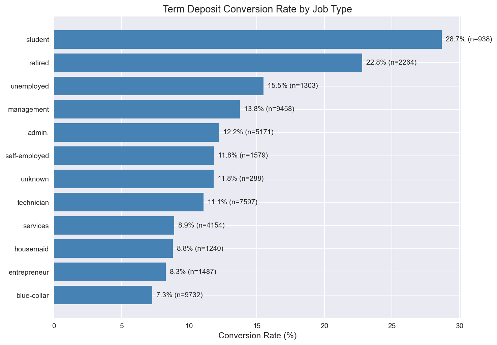
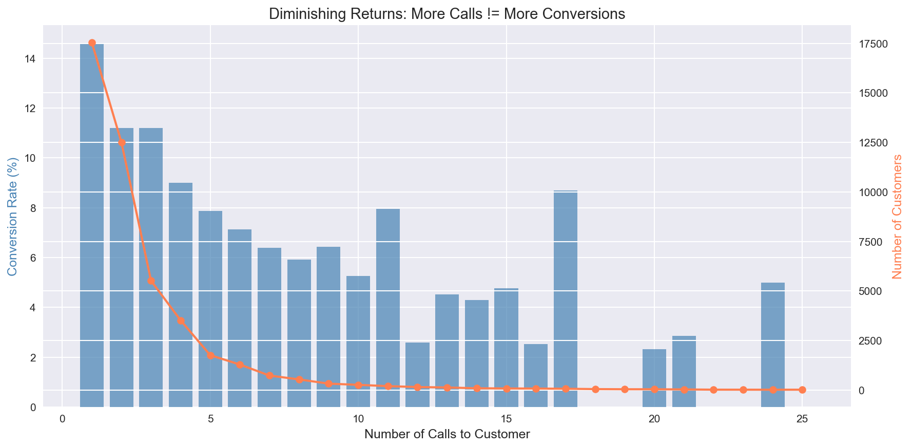
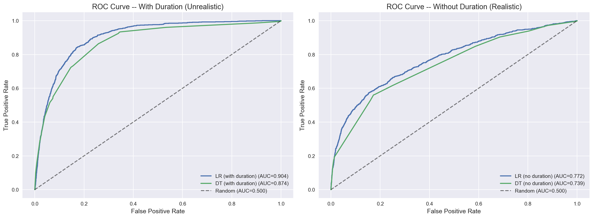
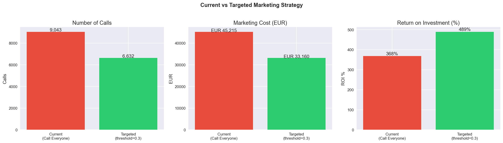

# How a Bank Can Cut 27% of Its Marketing Budget While Keeping 92% of Conversions

## The Problem

A Portuguese bank ran a direct marketing campaign, making over 45,000 phone calls to convince customers to open term deposits. The result? Only about 11% said yes. That means roughly 89% of calls — and the budget behind them — were wasted on people who were never going to subscribe.

This is a common problem in marketing: **spray and pray is expensive.** But what if data could tell us exactly who to call?

I analyzed the bank's campaign data to find out.

## What the Data Reveals

### 1. Not All Customers Are Created Equal

When I segmented customers by job type, age, education, and financial profile, conversion rates varied dramatically — from under 5% in some segments to over 30% in others. The bank was spending equal effort on all of them.

### 2. More Calls Don't Mean More Conversions

There's a clear point of diminishing returns. After about 3 calls to the same customer, the conversion rate drops sharply. Every additional call beyond that is money burned.

### 3. Past Behavior Predicts Future Behavior

Customers who subscribed in a previous campaign were dramatically more likely to convert again. This is the lowest-hanging fruit — yet the bank wasn't prioritizing them.

### 4. A Simple Model Can Identify the Best Targets

I trained a Logistic Regression model on customer demographics and campaign history (excluding call duration to avoid data leakage — since you can't know how long a call will last before making it).

The model isn't perfect, but it doesn't need to be. Even a modest ability to rank customers by likelihood saves significant budget.

## The Solution: Targeted Marketing

Instead of calling all 45,000+ customers, the bank calls only those the model predicts are likely to subscribe:

- **27% fewer calls** made
- **92% of conversions** still captured
- **ROI improves from 368% to 489%**

The math is simple: spend less on unlikely converters, keep almost all the revenue.

## 5 Recommendations for the Bank

1. **Use predictive models to build call lists** — stop blanket calling
2. **Focus on high-value segments** — retirees, students, and management roles convert best
3. **Limit to 3 calls per customer** — more calls waste money
4. **Prioritize previous converters** — they're far more likely to say yes again
5. **Use cellular contact** — higher conversion than landline telephone

## What I Learned

This project taught me how to go from raw data to business recommendations:
- Data cleaning and EDA with **Pandas** and **Seaborn**
- Predictive modeling with **Scikit-learn**
- Translating model output into **ROI impact**
- The importance of **data leakage awareness** in real-world ML

The full analysis notebook is on [GitHub](https://github.com/yourusername/marketanalysis).

---
*Built with Python, Pandas, Matplotlib, Seaborn, and Scikit-learn.*
*Dataset: UCI Bank Marketing Dataset.*
